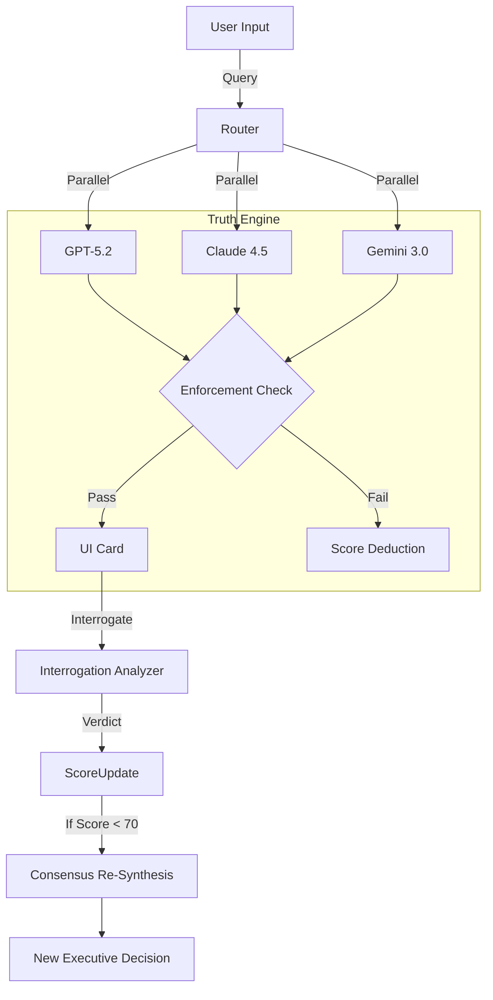

```mermaid
graph TD
    %% Frontend Layer
    subgraph Frontend [Frontend Browser]
        HTML[index.html]
        JS[app.js]
        CSS[enforcement.css / style.css]
        HTML --> JS
        JS --> HTML
        HTML --> CSS
    end

    %% Core Application Layer
    subgraph Core [Core Engine]
        APP[app.py Flask Server]
        WorkflowEngine[workflows.py Chains]
        DB_Manager[database.py]
        Proj_Manager[project_manager.py]
        
        JS -- /api/ask --> APP
        APP -- Load/Save --> DB_Manager
        APP -- Context --> Proj_Manager
        APP -- Execute --> WorkflowEngine
    end

    %% Intelligence Layer
    subgraph Brain [Intelligence and Regulation]
        Enforcement[enforcement.py Truth Police]
        Council[council_roles.py Prompts]
        Persona[persona_synthesizer.py Drift]
        Visuals[visuals.py Image Gen]

        APP -- Fetch Prompt --> Council
        APP -- Audit Response --> Enforcement
        Enforcement -- Read Rules --> Council
        APP -- Check Persona --> Persona
        APP -- Gen Image --> Visuals
    end

    %% Data Layer
    subgraph Data [Storage]
        SQLite[(comparisons.db)]
        JSON_Files[triai_projects/*.json]
        
        DB_Manager -- SQL --> SQLite
        Proj_Manager -- RW --> JSON_Files
    end

    %% Styles
    classDef core fill:#2a2a2a,stroke:#ffd700,stroke-width:2px;
    classDef brain fill:#1a1a2e,stroke:#00d4ff,stroke-width:2px;
    classDef front fill:#f0f0f0,stroke:#333,stroke-width:1px,color:#000;
    classDef data fill:#2e1a1a,stroke:#ff5555,stroke-width:2px;

    class APP,WorkflowEngine,DB_Manager,Proj_Manager core;
    class Enforcement,Council,Persona,Visuals brain;
    class HTML,JS,CSS front;
    class SQLite,JSON_Files data;
```

## 2026-02-05 Upgrade: The Truth Engine (Session 002)

### 1. The Enforcement Layer
*   **Location:** `enforcement.py` (Singleton `EnforcementEngine`)
*   **Trigger:** Post-Processing of every AI response.
*   **Logic:**
    *   **Truth Contracts:** Mapped in `council_roles.py`.
    *   **Scan:** Checks for generic verbs ("leverage"), unanchored numbers, and forbidden terms.
    *   **Penalty:** Deducts from `credibility_score` (Stateful per session).

### 2. The Interrogation Loop (Self-Correcting)
1.  **User/Auto Trigger:** Specific claim is flagged.
2.  **Cross-Examination:** `InterrogationAnalyzer` prompts the model to "Defend or Withdraw".
3.  **Forensics:** Detection of "Scope Violation", "Fabrication", or "Revision".
4.  **Feedback:** 
    *   Score penalized (e.g., -30 pts).
    *   **Consensus Re-Vote:** If score < 70, the Chairman (GPT-4o) executes `resynthesize_consensus()` with a "Compromised Advisor" warning injected into the context.

### Updated Flow

